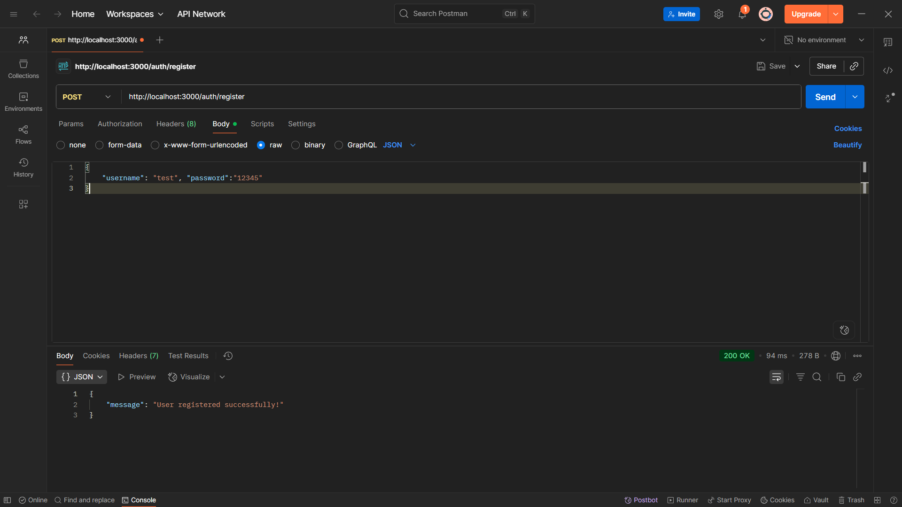
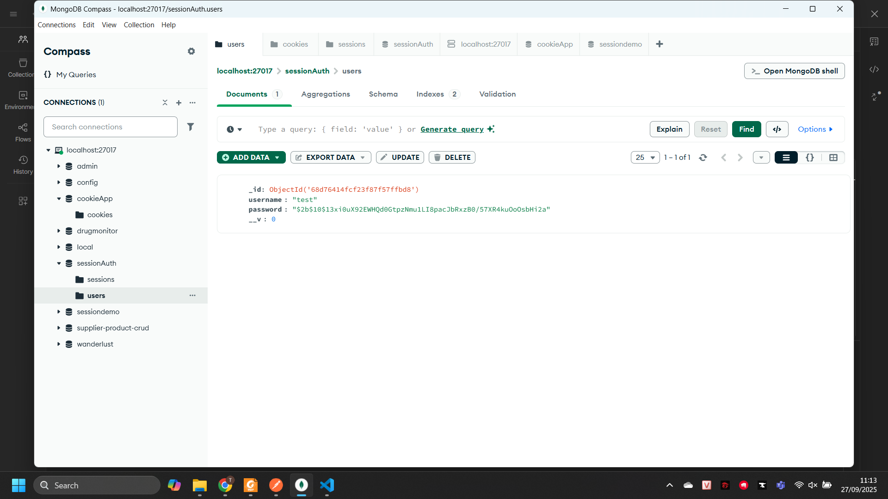
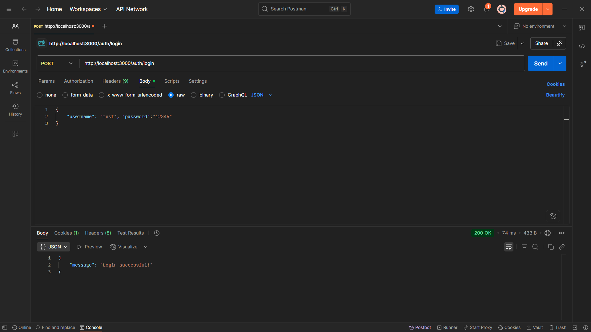
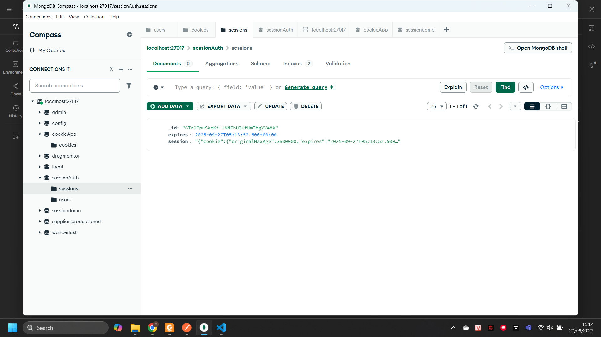
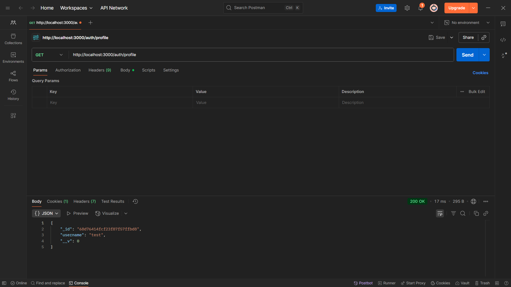
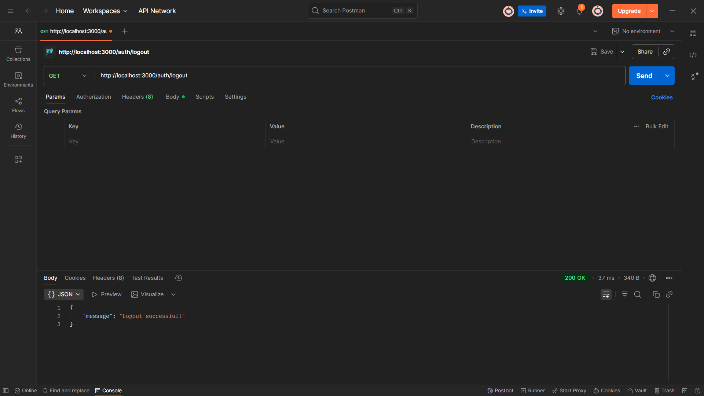
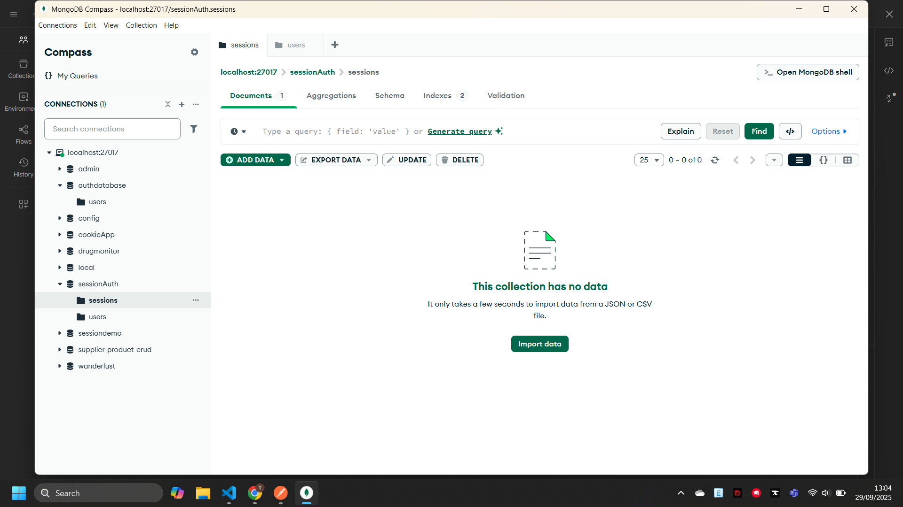

#### 1. Register User
- **Method**: POST
- **URL**: `http://localhost:3000/auth/register`

#### 2. Login
- **Method**: POST
- **URL**: `http://localhost:3000/auth/login`

#### 3. Profile (Protected Route)
- **Method**: GET
- **URL**: `http://localhost:3000/auth/profile`

#### 4. Logout
- **Method**: GET
- **URL**: `http://localhost:3000/auth/logout`

