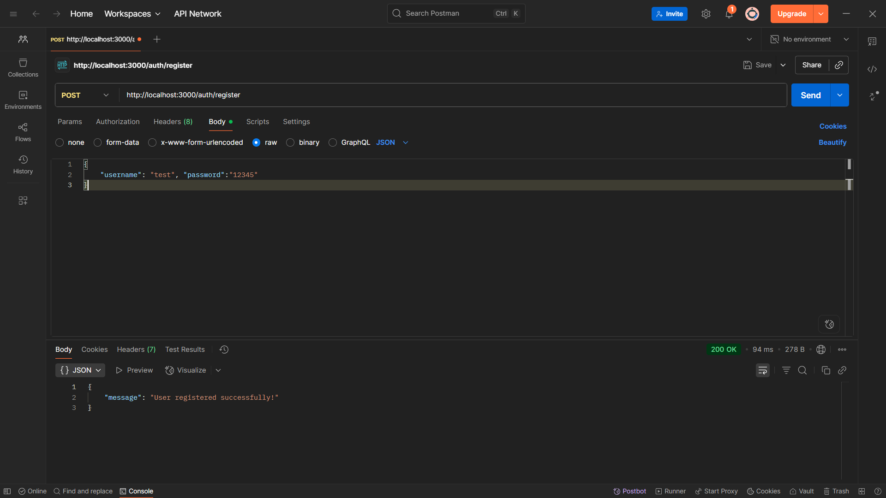
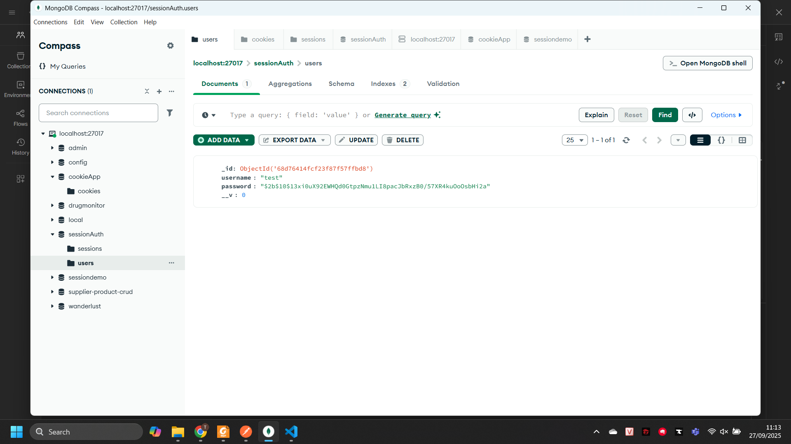
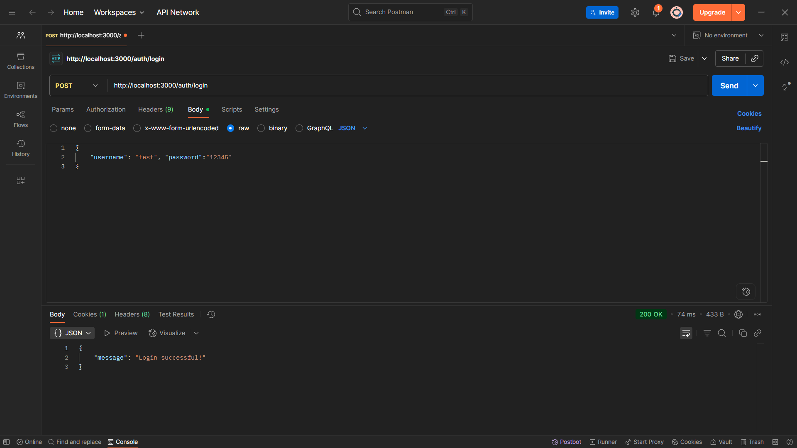
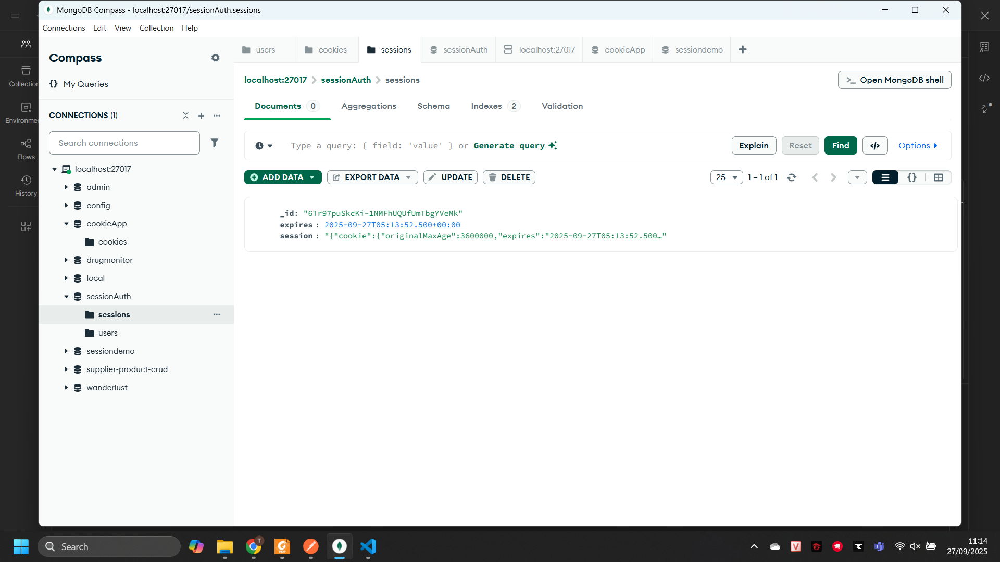
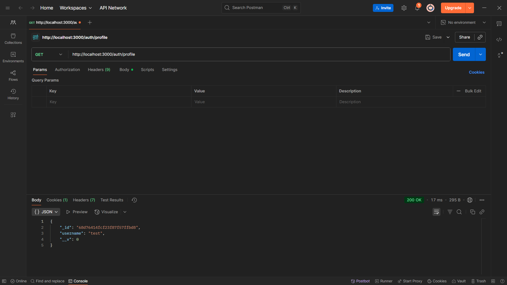

#### 1. Register User
- **Method**: POST
- **URL**: `http://localhost:3000/auth/register`



#### 2. Login
- **Method**: POST
- **URL**: `http://localhost:3000/auth/login`



#### 3. Logout
- **Method**: GET
- **URL**: `http://localhost:3000/auth/logout`
- **Prerequisites**: Must be logged in (have valid session cookie)
- **Success Response**:
  - Status Code: 200
  - Body: `{"message": "Logout successful!"}`
  - Cookie: `connect.sid` is cleared
- **Error Response**:
  - Status Code: 500
  - Body: `{"error": "Logout failed"}`

#### 4. Profile (Protected Route)
- **Method**: GET
- **URL**: `http://localhost:3000/auth/profile`


## Testing with Postman

### Complete Authentication Flow

#### Step 1: Register a New User
1. **Method**: POST
2. **URL**: `http://localhost:3000/auth/register`
3. **Headers**: Content-Type: `application/json`
4. **Body** (raw JSON):
```json
{
  "username": "johndoe",
  "password": "securepass123"
}
```
5. **Expected**: Success message

#### Step 2: Login
1. **Method**: POST
2. **URL**: `http://localhost:3000/auth/login`
3. **Headers**: Content-Type: `application/json`
4. **Body** (raw JSON):
```json
{
  "username": "johndoe",
  "password": "securepass123"
}
```
5. **Important**: After successful login, Postman automatically saves the session cookie
6. **Expected**: Login success message

#### Step 3: Access Protected Profile
1. **Method**: GET
2. **URL**: `http://localhost:3000/auth/profile`
3. **Prerequisites**: Must login first (Step 2)
4. **Expected**: User profile data (without password)

#### Step 4: Logout
1. **Method**: GET
2. **URL**: `http://localhost:3000/auth/logout`
3. **Expected**: Logout success message and cookie cleared

#### Step 5: Try Accessing Profile After Logout
1. **Method**: GET
2. **URL**: `http://localhost:3000/auth/profile`
3. **Expected**: 401 Unauthorized error

### Testing Error Cases

#### Invalid Registration (Duplicate Username)
- Try registering the same username twice
- **Expected**: 400 error with details

#### Invalid Login
- Use wrong username or password
- **Expected**: 400 "Invalid username or password"

#### Unauthorized Access
- Try accessing `/auth/profile` without logging in
- **Expected**: 401 "Unauthorized"
